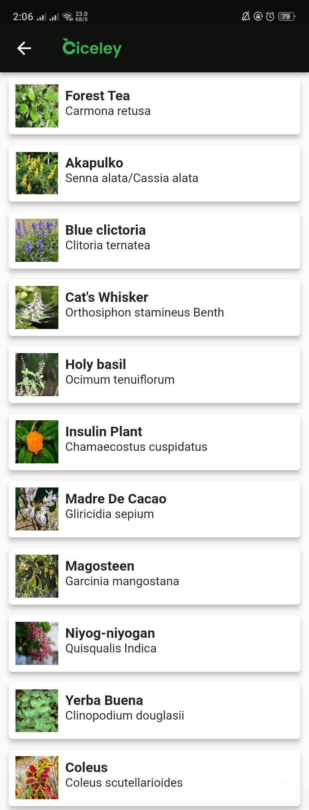
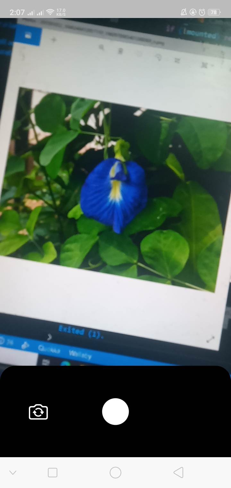
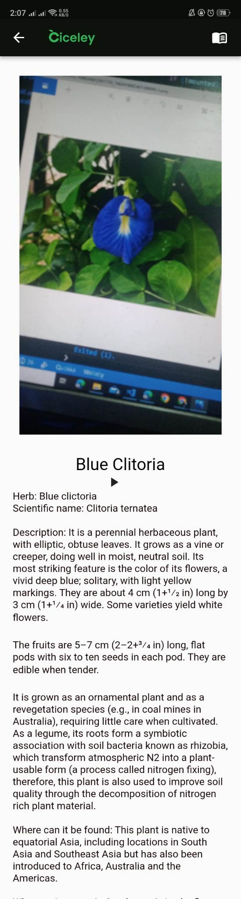
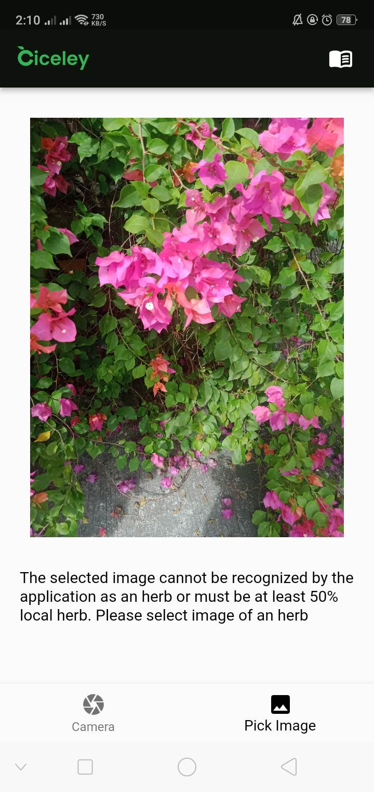

# Halamang Gamot App

Herbal App using image recognition and display description of the recognize herbal plant made in Flutter, Dart, Tensorflow

## Getting Started

This project is a starting point for a Flutter application.

A few resources to get you started if this is your first Flutter project:

- [Lab: Write your first Flutter app](https://flutter.dev/docs/get-started/codelab)
- [Cookbook: Useful Flutter samples](https://flutter.dev/docs/cookbook)

For help getting started with Flutter, view our
[online documentation](https://flutter.dev/docs), which offers tutorials,
samples, guidance on mobile development, and a full API reference.

## Screenshot of Application 

- Includes SplashScreen, Camera Permission and Pick Image, Listview of Herb, Tflite Model of Herb, Text to Speech, Details

#### Splashscreen

#### Main Screen

#### Listview of Included Herbs

#### Camera_Flutter

#### Output

#### Not Recognized Herb to 50%

